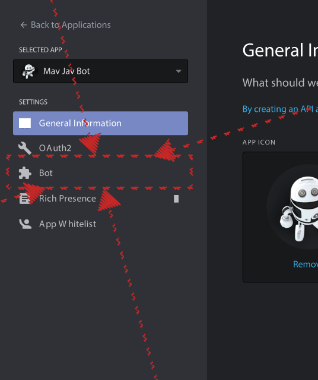
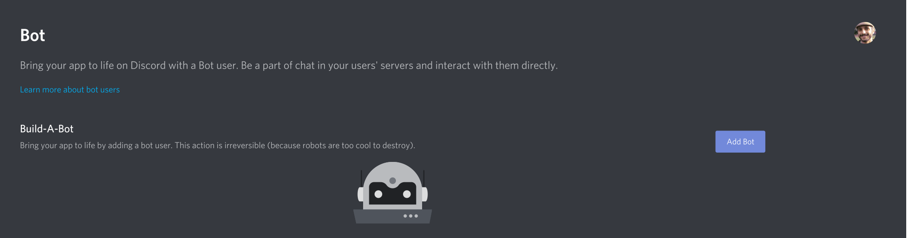
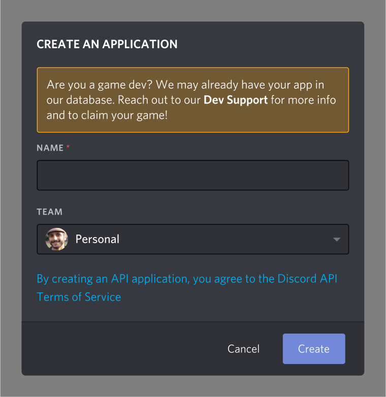
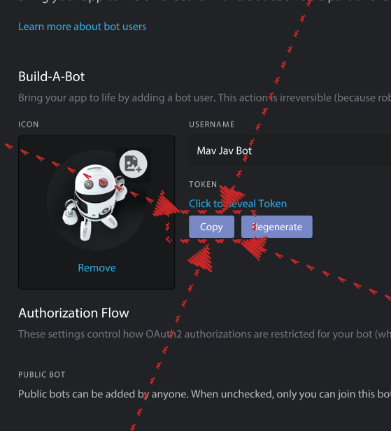
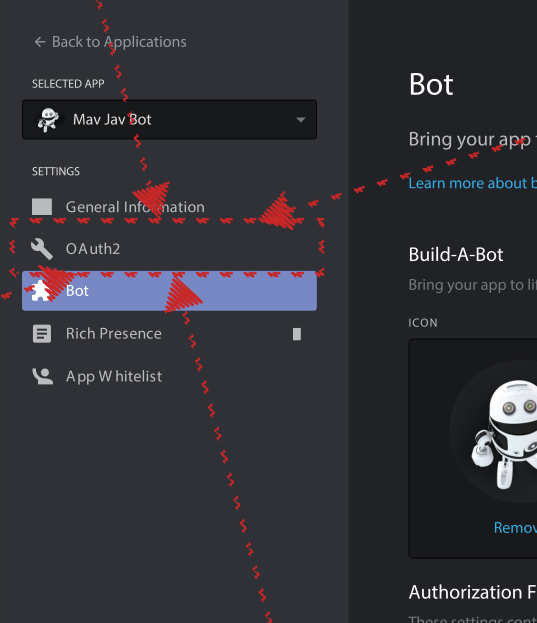
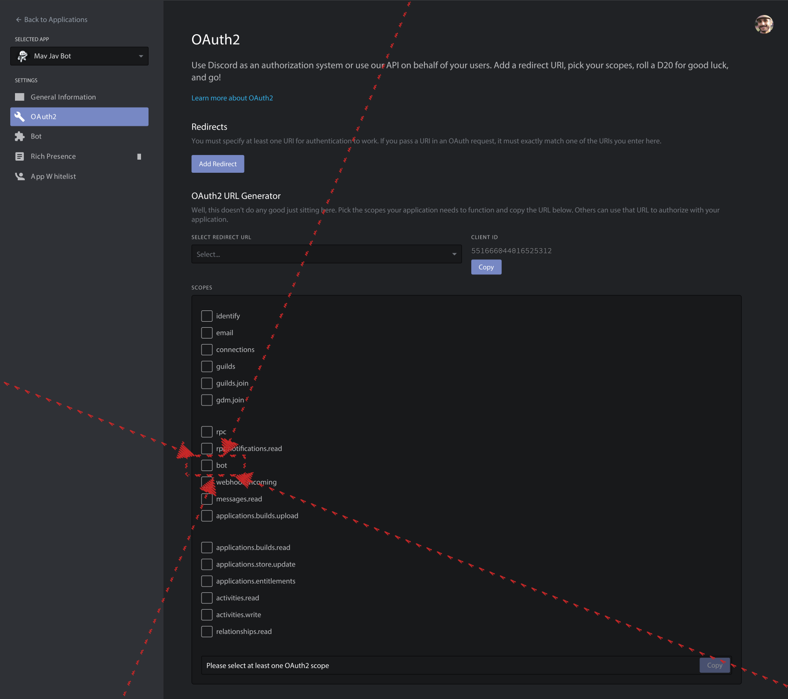
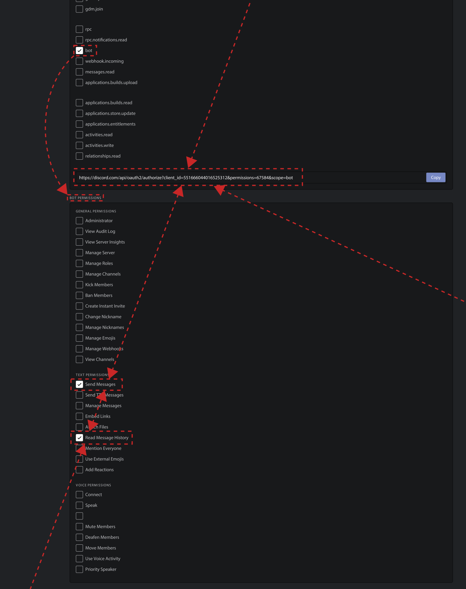

# Mav Jav Education bot

[](https://travis-ci.com/mavaddat-javid-education/discordpy)

<a href="https://discord.gg/KzzTBbr" alt="Discord server invite"></a>
<a href="https://pypi.python.org/pypi/discord.py"><object data="https://img.shields.io/pypi/v/discord.py.svg" type="image/svg+xml" alt="PyPI version info" height="20vh" align="initial"></object></a>
   [](https://saythanks.io/to/javid@mavaddat.ca)

[Mav Jav Education Discord server](https://discord.gg/KzzTBbr) bot. 

This project uses [Rapptz/discord.py](https://github.com/Rapptz/discord.py) to implement a [Discord](HTTPS://discord.gg) server bot. This bot is meant to be used as an educational tool to teach Python programming to kids🦸🏼‍♀️🦸🏼‍♂️🦸🏽‍♀️🦸🏽‍♂️ grades 7-12<sup id="a1">[1](#f1)</sup>. The bot is occassionally deployed on [Mav Jav Education Discord server](https://discord.gg/KzzTBbr) for testing.

## Features

1. Simple message-response

   - The [code](discordbot.py) includes templates for how to create commands that the bot recognizes and will respond to.

2. A timer function to remind the chat of a message after a specified time. This is achieved using multithreaded function calls to enable asynchronous input/output, allowing our bot to do work in the background without freezing up (being unresponsive to further commands until it finishes the work).
3. Subcommands. This demonstrates multiple variations on a central command (e.g., `!playMusic`, `!playSong`, `!playArtist`, `!playMovie`, `!playYouTube` all have the root `!play` followed by some target)

## Deploy

How do we get it running? You can assemble and deploy this bot using your own computer<sup id="a2">[2](#f2)</sup> to get an idea of how to create your own Python-powered bot on your Discord servers.

To try this, you will need some set up. If necessary, platform-specific instructions are given as links by major operating systems' icons: <a  alt="Windows 10 Logo"><object data="https://raw.githubusercontent.com/mavaddat-javid-education/images/master/icons/windows10.svg" type="image/svg+xml" alt="Windows 10 Logo" height="12vh" align="initial"></object></a> for Windows, <a alt="Linux logo" ><object data="https://raw.githubusercontent.com/mavaddat-javid-education/images/master/icons/linux.svg" type="image/svg+xml" alt="Linux logo" height="12vh" align="initial"></object></a> for Linux, and <a alt="macOS Logo" ><object data="https://raw.githubusercontent.com/mavaddat-javid-education/images/master/icons/macos.svg" type="image/svg+xml" alt="macOS Logo" height="12vh" align="initial"></object></a> for macOS. At each step, please judge for yourself whether you're missing knowledge to complete that step. If you think you need to learn, please click the icon that matches your operating system to learn more about that step.

### Prerequisites

- 🎓 [Understand](https://code.visualstudio.com/docs/python/python-tutorial) how to run Python in VS Code,
- 🎓 Understand Python [virtualenv](https://realpython.com/python-virtual-environments-a-primer/),
- 🎓 Shell familiarity (<a href="https://www.guru99.com/powershell-tutorial.html"><object data="https://raw.githubusercontent.com/mavaddat-javid-education/images/master/icons/windows10.svg" type="image/svg+xml" alt="Windows 10 Logo" height="12vh" align="initial"></object></a>, <a href="https://www.bash.academy/"><object data="https://raw.githubusercontent.com/mavaddat-javid-education/images/master/icons/linux.svg" type="image/svg+xml" alt="Linux logo" height="12vh" align="initial"></object></a>, <a href="https://tidbits.com/2019/12/08/resources-for-adapting-to-zsh-in-catalina/"><object data="https://raw.githubusercontent.com/mavaddat-javid-education/images/master/icons/macos.svg" type="image/svg+xml" alt="macOS Logo" height="12vh" align="initial"></object></a>),
- [ install discord.py](https://pypi.org/project/discord.py/) module,
- [ install VS Code](https://code.visualstudio.com
),
- [ Git](https://marketplace.visualstudio.com/items?itemName=donjayamanne.git-extension-pack),
- [ Python](https://marketplace.visualstudio.com/items?itemName=ms-python.python),
-  Fernet [cryptography](https://pypi.org/project/cryptography/) module

### Run ▶

To actually get this code running, follow these 11 steps:

1. Clone [this repository](https://github.com/mavaddat-javid-education/discordpy.git) in VS Code ([how?](https://youtu.be/f3DBSH2VoHQ))
2. Enter the `discordpy` directory using a shell (how <a href="https://docs.microsoft.com/en-us/powershell/module/microsoft.powershell.management/set-location?view=powershell-7"><object data="https://raw.githubusercontent.com/mavaddat-javid-education/images/master/icons/windows10.svg" type="image/svg+xml" alt="Windows 10 Logo" height="12vh" align="initial"></object></a>, <a href="http://linuxcommand.org/lc3_lts0010.php"><object data="https://raw.githubusercontent.com/brandonmaul/brandonmaul.github.io/dc9ec94fac737539b038ed92b739dc23b6e0a3e0/vendor/fontawesome-free/svgs/brands/linux.svg" type="image/svg+xml" alt="Linus logo" height="12vh" align="initial"></object></a>, <a href="https://macpaw.com/how-to/use-terminal-on-mac"><object data="https://raw.githubusercontent.com/mavaddat-javid-education/images/master/icons/macos.svg" type="image/svg+xml" alt="macOS Logo" height="12vh" align="initial"></object></a>)
3. Create a Python virtual environment here called `venv`

   ```shell
   virtualenv venv
   ```

4. Activate the Python virtual environment `venv`
   ([how macOS/Linux](https://youtu.be/Kg1Yvry_Ydk), [how Windows](https://youtu.be/APOPm01BVrk)),

   ```cmd
   .\venv\Scripts\activate.bat
   ```

   or

   ```powershell
   .\venv\Scripts\Activate.ps1
   ```

   or

   ```bash
   source ./venv/Scripts/activate
   ```

5. Get an OAuth2 token from Discord (it will be the 'secret' for `writeToken.py`)
   1. Go to the [Discord developers' applications page](https://discord.com/developers/applications/)
   2. Create an application or click the application you created for this bot
   3. Click the 'Bot' tab with puzzle piece <object data="discordPuzzle.svg" type="image/svg+xml" alt="'Bot' tab on Discord developer's application" height="20vh" align="initial"></object> icon <object data="botTab.svg" type="image/svg+xml" alt="Bot tab" height="260vh" align="initial"></object>
   4. Add a bot to the application (if a bot is not already in the application) <object data="botPage.svg" type="image/svg+xml" alt="Add 'Bot' prompt on Discord developer's application" height="164vh" align="initial"></object> <object data="addBot.svg" type="image/svg+xml" alt="Add 'Bot' prompt on Discord developer's application" width="300vh" align="initial"></object>
   5. Click 'Copy' under 'TOKEN' <object data="copyToken.svg" type="image/svg+xml" alt="Copy the token" height="280vh" align="initial"></object>
6. Write your token into the keyring or create your Fernet `token` and `key` by pasting the auth token into Python shell running [writeToken.py](writeToken.py) script<sup id="a3">[3](#f3)</sup>
7. Go to the OAuth2 tab <object data="oauthTab.svg" type="image/svg+xml" alt="OAuth2 tab" height="301vh" align="initial"></object>
8. Check the box for `bot` role 
9. Check boxes for the permissions `Send Messages` and `Read Message History` to generate a URL inivitation 
10. Invite your bot to join your server by copying the URL generated by the permissions calculating tool in step [8](#8). The URL will have the format `https://discord.com/api/oauth2/authorize?client_id=`{CLIENT_ID}`&permissions=`{PERMISSIONS_NUMBER}`&scope=bot`  (Your bot won't actually appear in your server until the last step, [11](#10))
11. Run the [discordbot](discordbot.py) on your computer inside VS Code ([how?](https://code.visualstudio.com/docs/editor/debugging))

That's it! The bot now should be running on your server.


## TODO

This repository is a work-in-progress. I still need to add the following to the README.

- [x] ~~Explain prerequisites to start~~
- [x] ~~Instructions on how to deploy bot~~
- [x] ~~Explain features of the bot~~
- [ ] Explain how to add your own features
- [ ] Explain remote `server`, local `computer`, multithreading, asynchronous
- [ ] Security principles motivating encryption, least privilege
- [ ] SVG recording of `bash` and `PowerShell` demonstrating each step
- [ ] Add functionality of Discord.py
  - [ ] Re-invite students who leave sever
    - [ ] Re-assign roles
  - [ ] Connect to `MySQL db`
  - [ ] Welcome message
  - [ ] Moderation
  - [ ] Auto role
  - [ ] Twitch, YouTube, Reddit, Mixer alerts
  - [ ] Pokémon catching
  - [ ] Accept donations
  - [ ] Meme maker
  - [ ] Mini games
    - Quiz games
      - Music trivia
      - Gaming trivia
      - Tidbits knowledge test
        - Asks channel a small question about topic
        - Keeps track of points
  - [ ] Member levels and XP
  - [ ] Role rewards
  - [ ] Play music/videos
    - YouTube • Tracks, Playlists, Searches, Links, Streams
    - SoundCloud • Tracks, Playlists, Searches, Links
    - Spotify • Links to tracks, Playlists
    - Twitch • Links to streams
    - Mixer • Links to streams
    - BandCamp • Links to tracks and albums
  - [ ] Pull stats from https://tracker.gg/
    - Apex Legends
    - CSGO
    - Division 2
    - Overwatch
    - Splitgate
    - Fortnite Power Rankings
- [ ] Multilingual translations

[<a id="f1">\[1\]</a>](#a1) To use [Discord](https://en.wikipedia.org/wiki/Discord), students must be &GreaterEqual; 13, the age of digital consent in Canada and USA. If you are not thirteen years old (13) yet, please seek your guardian's or parents' assistance. Your guardian or parents can sign up for Discord and help you get your bot going.[↩](#a1)

[<a id="f2">\[2\]</a>](#a2) The purpose of this bot is to motivate kids to learn to code. <br/> My bot is **not** a "public bot" (unlike [top.gg bots](https://top.gg) you might know), so it cannot be added by invitation. <object data="invite.svg" type="image/svg+xml" alt="Normal invitation" height="48vh" align="initial"></object>[↩](#a2)

[<a id="f3">\[3\]</a>](#a3) This step will use [jaraco/keyring](https://github.com/jaraco/keyring) to store and retrieve the key securely from the system credential manager or keychain. You will store the token once and `keyring` retrieves the token securely from then on. <br/> Optionally, you can encrypt the OAuth2 token so that it can be securely stored as a file locally. In the latter case, the `writeToken.py` script also attempts to append the `.gitignore` manifest so that we do not upload the `token` or `key` file onto a repository. The file `key` must be kept secret, but `token` is encrypted safe even if acquired by an adversary. That is, anyone who has the key can decrypt the token, but having the encrypted token will be useless (that is the purpose of encryption). <br/> Notice that **keeping the key in the same location as the encrypted file (in the same file system) is a security risk**, but the purpose of this option to demonstrate the method of file encryption.[↩](#a3)
